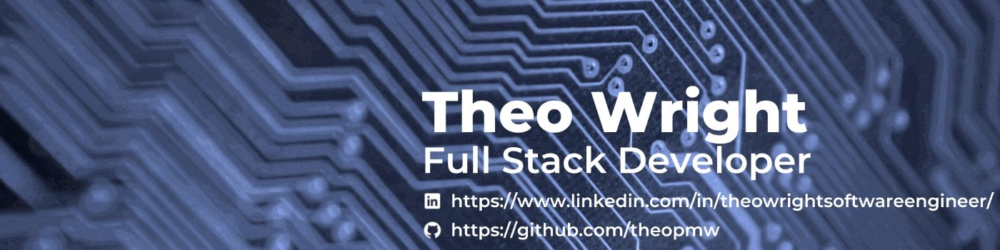

# THEO WRIGHT

### Full Stack Software Developer

---

### Contact Me

---

### Programming Languages

### Frameworks, Libraries & APIs

### Databases

### Hosting

### Cloud Platforms

### Design & Wireframes

### Version Control, IDE's & Other Coding Content

<!-- ### Social -->

<!--  -->

<!--  -->

<!-- 

 -->

---

<!--  -->
